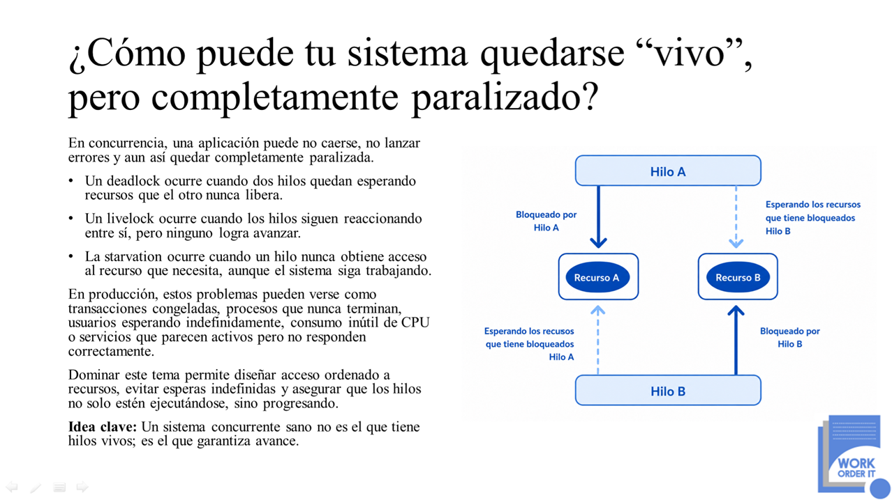

<p align="center">
  
</p>

# Python Deadlock Prevention Lab

Laboratorio práctico de concurrencia en Python que demuestra cómo varios hilos pueden permanecer activos y, al mismo tiempo, quedar completamente paralizados por un **deadlock**.

El proyecto utiliza dos transferencias simultáneas entre cuentas para reproducir una espera circular y posteriormente aplica una estrategia de ordenamiento de locks para evitarla.

## Objetivo

Comprender:

* Cómo ocurre un deadlock con `threading.Lock`.
* Por qué un proceso puede seguir activo sin completar su trabajo.
* Cómo reconocer una espera circular.
* Cómo prevenir deadlocks mediante un orden estable de adquisición.
* La importancia del progreso en sistemas concurrentes.

## Escenario

Dos hilos realizan transferencias en sentidos opuestos:

* Una transferencia bloquea primero `Cuenta-A`.
* La otra transferencia bloquea primero `Cuenta-B`.
* Cada hilo intenta adquirir posteriormente el lock retenido por el otro.

El resultado es una espera indefinida en la que ningún hilo puede completar su operación.

## Estructura del proyecto

```text
python-deadlock-prevention-lab/
├── src/
│   ├── deadlock_problem.py
│   └── deadlock_solution.py
├── .gitignore
└── README.md
```

## Ejemplo con deadlock

`deadlock_problem.py` adquiere los locks según el sentido de la transferencia:

```python
with from_account.lock:
    with to_account.lock:
        from_account.withdraw(amount)
        to_account.deposit(amount)
```

Cuando dos transferencias trabajan con las mismas cuentas en sentidos opuestos, pueden adquirir los locks en órdenes diferentes.

Una transferencia conserva el lock de `Cuenta-A` mientras espera `Cuenta-B`. La otra conserva `Cuenta-B` mientras espera `Cuenta-A`.

El proceso permanece activo, pero las transferencias no terminan.

## Solución implementada

`deadlock_solution.py` utiliza el identificador de cada cuenta para establecer un orden único:

```python
if from_account.account_id < to_account.account_id:
    first_lock = from_account.lock
    second_lock = to_account.lock
else:
    first_lock = to_account.lock
    second_lock = from_account.lock

with first_lock:
    with second_lock:
        from_account.withdraw(amount)
        to_account.deposit(amount)
```

Ambos hilos intentan adquirir los locks siguiendo el mismo orden lógico.

Uno de ellos puede esperar hasta que el otro libere los recursos, pero no se forma una dependencia circular.

## Requisitos

* Python 3.10 o superior.
* Terminal, PyCharm, Visual Studio Code o cualquier editor compatible.
* No requiere paquetes externos.
* Utiliza únicamente módulos de la biblioteca estándar.

## Ejecutar el problema

Desde la raíz del proyecto:

```bash
python src/deadlock_problem.py
```

En algunos entornos puede utilizarse:

```bash
python3 src/deadlock_problem.py
```

El programa puede quedarse ejecutándose indefinidamente debido al deadlock.

Para detenerlo manualmente:

```text
Ctrl + C
```

## Ejecutar la solución

```bash
python src/deadlock_solution.py
```

La ejecución debe:

1. Crear las cuentas compartidas.
2. Iniciar las dos transferencias.
3. Adquirir los locks en un orden consistente.
4. Completar las operaciones.
5. Mostrar los saldos finales.
6. Finalizar correctamente.

## Principio aplicado

La solución elimina la espera circular mediante una regla sencilla:

> Todos los hilos que necesiten los mismos recursos deben adquirirlos siguiendo el mismo orden.

El orden no debe depender de la dirección de la transferencia, sino de una propiedad estable, como el identificador de la cuenta.

## Conceptos relacionados

### Deadlock

Dos o más hilos esperan recursos retenidos entre ellos y ninguno puede avanzar.

### Livelock

Los hilos permanecen activos y reaccionan entre sí, pero no consiguen completar su trabajo.

### Starvation

Un hilo queda esperando continuamente porque otros hilos obtienen acceso al recurso antes que él.

Este laboratorio implementa específicamente ejemplos de deadlock y su prevención.

## Aprendizaje principal

La existencia de hilos activos no garantiza que una aplicación esté funcionando correctamente.

En programación concurrente, el diseño debe garantizar no solamente ejecución, sino también progreso.

Los locks deben adquirirse mediante una estrategia consistente que evite dependencias circulares entre los hilos.

## Autor

**Work Order IT**  
Soluciones tecnológicas, arquitectura de software y formación técnica para equipos de desarrollo.

Este repositorio forma parte de una iniciativa educativa orientada a explicar cómo la concurrencia en **Python 3.13** puede acelerar un sistema o volverlo impredecible cuando el estado compartido no se controla correctamente.

Website: [www.workorder-it.net](https://www.workorder-it.net)
